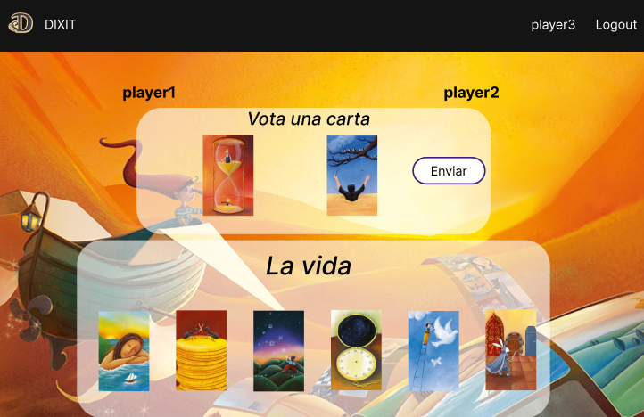

# Documento de análisis de requisitos del sistema

_Esta es una plantilla que sirve como guía para realizar este entregable. Por favor, mantén las mismas secciones y los contenidos que se indican para poder hacer su revisión más ágil._ 

## Introducción

Dixit es un juego de mesa de 3 a 4 jugadores, en la que cada uno tendrá 6 cartas con distintos diseños artísticos. En cada turno habrá un cuentacuentos, éste es el encargado de anunciar un tema inspirado en una de las cartas que disponga en su mano.

Dicho tema podrá ser una palabra, una frase, una onomatopeya o incluso puede ser inventado.

Una vez anunciado el tema, el resto de jugadores tiene que escoger una carta de su mano que crea que encaje mejor con el tema. Estas cartas junto a la del narrador se pondrán al azar boca arriba sobre la mesa.

El objetivo de los jugadores es elegir la carta del cuentacuentos de entre todas las cartas de la mesa. Cada jugador selecciona una carta en secreto y una vez todos hayan elegido, el cuentacuentos dirá cual era la suya.

Puntuación: si todos o ninguno de los jugadores escogió la carta del cuentacuentos, todos los jugadores menos el cuentacuentos reciben 2 puntos. En cualquier otro caso, el cuentacuentos y los jugadores que han acertado la carta consiguen 3 puntos cada uno. Todos los jugadores (excepto el narrador) consigue un punto adicional por cada voto que consiguió su carta.

Una vez finalizado el turno, los jugadores cogen una carta del mazo central para volver a tener 6 y el cuentacuentos será el jugador a la izquierda del último cuentacuentos.

La partida termina cuando todos los jugadores han sido cuentacuentos 2 veces y el jugador con más puntos gana la partida.

[Enlace al vídeo de explicación de las reglas del juego / partida jugada por el grupo](https://youtu.be/Rh_IryzAuRQ)

## Tipos de Usuarios / Roles

Administrador: Tiene las capacidades de un jugador. Adicionalmente cuenta con características de moderación de la comunidad. Como ver listados de jugadores, eliminarlos o actualizar información sobre ellos.

Jugador: Usuario registrado en la plataforma del juego. Es capaz de ver su perfil y actualizarlo, crear partidas o unirse a ellas.

## Historias de Usuario

A continuación se definen las historias de usuario a implementar:

### HU-1: Registro de jugador.
Como jugador quiero poder crear una cuenta de usuario para poder jugar al juego,  pudiendo establecer mi nombre de usuario, contraseña y foto de perfil.

### HU-2: Inicio de sesión de jugador.
Como jugador quiero que, haciendo uso de mi nombre de usuario y contraseña, pueda ingresar en mi cuenta de usuario para poder jugar.

### HU-3: Cierre de sesión de jugador.
Como usuario de la aplicación, quiero que el sistema me permita cerrar sesión en mi 
cuenta para proteger mi privacidad y finalizar mi sesión actual.

### HU-4: Editar el perfil.
Como jugador quiero poder cambiar mi nombre de usuario en la información de mi cuenta.

### HU-5: Eliminar cuenta.
Como jugador quiero poder eliminar mi cuenta del juego, además de mi información asociada.

### HU-6: Creación de partida. 
Como jugador quiero que aparezcan las 6 cartas de mi mano y algún identificativo del resto de juagadores que estan en la partida para poder llevar a cabo el desarrollo del juego.

### HU-7: Datos de creación de partida. 
Como jugador registrado, deseo que el sistema me permita crear partidas, que se visualizará en el listado de partidas para que otros jugadores registrados puedan unirse a mi partida.

### HU-8: Inicio de partida.
Como jugador del sistema, deseo que el sistema me permita poder iniciar una partida una 
vez que haya mínimo tres personas unidas (incluyéndome a mí como jugador), para poder 
comenzar a jugar.

### HU-9: Sistema de turnos.
Como jugador quiero que la asignación del primer turno sea del jugador que crea la partida.

### HU-10: Número de turnos.
Como jugador quiero que todos ejerzamos de cuentacuentos 2 veces por partida.

### HU-11: Elegir tema.
Como jugador quiero que cuando sea cuentacuentos, me permita elegir un tema que sera sobre el que se jugará en esa ronda.

### HU-12: Elegir carta.
Como jugador quiero poder seleccionar una carta que me parezca acorde al tema elegido en dicha ronda.

### HU-13: Votar carta.
Como jugador, excepto si soy cuentacuentos, quiero votar la carta que crea que es la elegida por el cuentacuentos de dicha ronda.

### HU-14: Puntuación jugador.
Como jugador quiero que, de acorde a las reglas del juego, se me asignen los puntos que he conseguido en cada ronda.

### HU-15: Ganar una partida.
Como jugador, deseo que el sistema permita saber que he ganado la partida, para que el 
resto de jugadores sepan que he ganado y acaba la partida.

### HU-16: Listado de partidas.
Como jugador, deseo ver el listado de partidas que hay creadas para poder acceder y jugar en ellas.

### HU-17: Listado de usuarios.
Como administrador, deseo ver el listado de usuarios que hay registrados en el sistema.

### HU-18: Unirse a partidas.
Como jugador registrado, quiero que el sistema me permita unirme a partidas 
multijugador en línea para competir con otros jugadores y disfrutar de una experiencia de 
juego social.

## Diagrama conceptual del sistema
En esta sección debe proporcionar un diagrama UML de clases que describa el modelo de datos a implementar en la aplicación. Este diagrama estará anotado con las restricciones simples (de formato/patrón, unicidad, obligatoriedad, o valores máximos y mínimos) de los datos a gestionar por la aplicación. 

## Reglas de Negocio

### R1 – Limitación de cartas
Cada partida de Dicit debe constar de exactamente 36 cartas y a cada jugador se le asignará 6. Por cada ronda se quitará la carta usada y se le asignara una nueva del mazo de cartas no usadas.

### R2 – Limitacion de jugadores en una partida
Las partidas deben restringirse por el número de jugadores, de manera que no se puedan 
jugar partidas con un número de jugadores inferior a 3 ni superior a 4, cómo así viene 
indicado en las reglas del juego original.

### R3 – Restricciones de la selección del tema
De acorde a las reglas del juego, el tema puede ser una palabra, una frase o una onomatopeya, puede ser inventado y también puede ser una cita, un verso de un poema, una estrofa de una canción, un título de un libro o de una película.

### R4 – Usuarios repetidos
Los usuarios que se registren una vez, no se podrán a volver a registrar con los mismos 
datos. Por ejemplo, si nos queremos registrar con los mismos datos de un usuario que ya 
se encuentra en la base de datos, no se podrá realizar la acción.

### R5 - Prohibición voto cuentacuentos
Los jugadores que tengan el papel de cuentacuento no podrán votar en esa ronda.

### R6 - Fin de partida
La partida finalizará cuando todos los jugadores hayan jugado como cuentacuentos en dos ocasiones.

