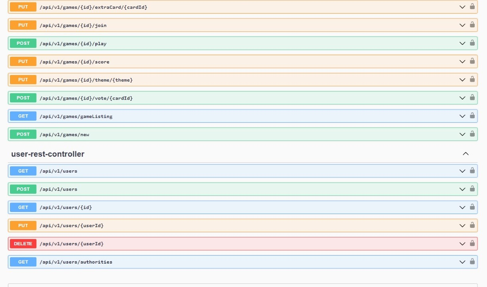

# Documento de diseño del sistema

_Esta es una plantilla que sirve como guía para realizar este entregable. Por favor, mantén las mismas secciones y los contenidos que se indican para poder hacer su revisión más ágil._ 

## Introducción

Dixit es un juego de mesa de 3 a 4 jugadores, en la que cada uno tendrá 6 cartas con distintos diseños artísticos. En cada turno habrá un cuentacuentos, éste es el encargado de anunciar un tema inspirado en una de las cartas que disponga en su mano.

Dicho tema podrá ser una palabra, una frase, una onomatopeya o incluso puede ser inventado.

Una vez anunciado el tema, el resto de jugadores tiene que escoger una carta de su mano que crea que encaje mejor con el tema. Estas cartas junto a la del narrador se pondrán al azar boca arriba sobre la mesa.

El objetivo de los jugadores es elegir la carta del cuentacuentos de entre todas las cartas de la mesa. Cada jugador selecciona una carta en secreto y una vez todos hayan elegido, el cuentacuentos dirá cual era la suya.

Puntuación: si todos o ninguno de los jugadores escogió la carta del cuentacuentos, todos los jugadores menos el cuentacuentos reciben 2 puntos. En cualquier otro caso, el cuentacuentos y los jugadores que han acertado la carta consiguen 3 puntos cada uno. Todos los jugadores (excepto el narrador) consigue un punto adicional por cada voto que consiguió su carta.

Una vez finalizado el turno, los jugadores cogen una carta del mazo central para volver a tener 6 y el cuentacuentos será el jugador a la izquierda del último cuentacuentos.

La partida termina cuando todos los jugadores han sido cuentacuentos 2 veces y el jugador con más puntos gana la partida.

[Enlace al vídeo de explicación de las reglas del juego / partida jugada por el grupo](https://youtu.be/Rh_IryzAuRQ)

## Diagrama UML:

### Diagrama de Capas (incluyendo Controladores, Servicios y Repositorios)
_En esta sección debe proporcionar un diagrama UML de clases que describa el conjunto de controladores, servicios, y repositorios implementados, incluya la división en capas del sistema como paquetes horizontales tal y como se muestra en el siguiente ejemplo:

## Descomposición de los mockups más importantes en componentes

En esta sección procesaremos los mockups más importantes (*como mínimo debe realizarse para los componentes que va a permitir representar el tablero e interfaz de juego en las distintas fases de la partida*) creados para la interfaz de usuario en el documento de requisitos y etiquetaremos las zonas de cada una de las pantallas para identificar componentes a implementar. Para cada mockup se especificará el árbol de jerarquía de componentes, así como, para cada componente el estado que necesita mantener, las llamadas a la API que debe realizar y los parámetros de configuración global que consideramos que necesita usar cada componente concreto. 
Por ejemplo, para la pantalla de visualización de métricas del usuario en un hipotético módulo de juego social:

#### Login

  - App – Componente principal de la aplicación.
    - $\color{red}{\textsf{LoginForm – Área con campos a rellenar para acceder al sistema mediante el uso de credenciales.}}$
      - $\color{blue}{\textsf{[ Login ]. Botón para hacer submit de la información de los campos.}}$

#### Register

  
  - App – Componente principal de la aplicación.
    - $\color{red}{\textsf{RegisterForm – Área con campos a rellenar para crear un nuevo usuario del sistema.}}$
      - $\color{blue}{\textsf{[ Save ]. Botón para hacer submit de la información de los campos.}}$

#### Listado de partidas

  - App – Componente principal de la aplicación.
    - $\color{red}{\textsf{GamesList – Tabla que contiene toda la información relevante de las partidas que hay en activo.}}$
      - $\color{blue}{\textsf{[ Join ]. Botón para acceder a la sala de espera de la partida.}}$
      - $\color{yellow}{\textsf{[ Crear partida ]. Botón para crear una nueva partida.}}$
      - $\color{green}{\textsf{[ Volver ]. Botón para acceder a la pagina principal de los jugadores en la aplicación.}}$

#### Partida

  - App – Componente principal de la aplicación.
    - $\color{red}{\textsf{GameBoard – Componente tablero de juego.}}$
      - $\color{yellow}{\textsf{[ NamePlayers ]. Nombre de los jugadores que hay dentro de la partido (exceptuandote a ti).}}$
      - $\color{darkviolet}{\textsf{[ GameArea ]. Sección donde aparecen los elementos necesarios para poder jugar.}}$
        - $\color{green}{\textsf{[ ThemeInput ]. Campo para introducir el tema con el que se jugará en la ronda.}}$
        - $\color{pink}{\textsf{[ Send Theme ]. Botón para mandar el tema sobre el que se va a jugar al resto de jugadores.}}$
        - $\color{blue}{\textsf{[ CardList ]. Lista de las 6 cartas seleccionables de las que disponemos por ronda.}}$
        - $\color{black}{\textsf{[ Send Card ]. Botón para enviar la carta seleccionada y que pueda ser votada por los demás jugadores.}}$

## Documentación de las APIs
Se considerará parte del documento de diseño del sistema la documentación generada para las APIs, que debe incluir como mínimo, una descripción general de las distintas APIs/tags  proporcionadas. Una descripción de los distintos endpoints y operaciones soportadas. Y la especificación de las políticas de seguridad especificadas para cada endpoint y operación. Por ejemplo: “la operación POST sobre el endpoint /api/v1/game, debe realizarse por parte de un usuario autenticado como Player”.

## Patrones de diseño y arquitectónicos aplicados
En esta sección de especificar el conjunto de patrones de diseño y arquitectónicos aplicados durante el proyecto. Para especificar la aplicación de cada patrón puede usar la siguiente plantilla:

### Patrón: Capas
*Tipo*: Arquitectónico

*Contexto de Aplicación*

En nuestro proyecto basado en React y Spring, hemos aplicado el estilo arquitectónico de Capas para 
organizar y estructurar nuestras funcionalidades de manera modular y fácilmente mantenible. Las 
distintas capas del patrón arquitectónico son:

Capa de Presentación (React):

* Descripción: En esta capa, se emplea React para construir la interfaz de usuario de la aplicación. 
Se aplican prácticas de desarrollo modernas utilizando componentes funcionales y de clase, manejo de 
estado y propiedades para gestionar la interfaz de usuario.

* Notación: En este contexto, la notación @RestController se utiliza para marcar los controladores 
de React que gestionan las solicitudes HTTP y manejan las interacciones del usuario. Estos 
controladores son responsables de recibir y enviar datos entre el frontend y el backend, se ubican 
en src\main\java\org\springframework\samples\petclinic\, dentro de esta carpeta en los distintos componentes como card o game se encuentran los controller.

Capa de Lógica de Negocio (Spring Service):

* Descripción: Las clases con la anotación @Service encapsulan la lógica de negocio de la aplicación. Estas clases se encargan de procesar datos, aplicar reglas de negocio y coordinar las operaciones entre la capa de presentación y la capa de acceso a datos.La capa de lógica de negocio está implementada en src\main\java\org\springframework\samples\petclinic\, dentro de esta carpeta en los distintos componentes como card o game se encuentran los services.

* Notación: La notación @Service se utiliza para identificar las clases que actúan como servicios de 
negocio. Estos servicios se encargan de la implementación de la lógica empresarial y son 
consumidos por los controladores en la capa de presentación.

Capa de Acceso a Datos (Spring Data JPA):

* Descripción: En la capa de acceso a datos, se utiliza Spring Data JPA para interactuar con la base 
de datos. Los repositorios se encuentran en el paquete src/main/java/com/dobble/repositories y 
las entidades persistentes se modelan en el paquete src/main/java/com/dobble/model. Los 
repositorios manejan las operaciones de lectura y escritura en la base de datos, mientras que las 
entidades representan las tablas de la base de datos.
* Notación: La notación @Repository se utiliza para marcar las clases que actúan como repositorios, 
gestionando la interacción con la base de datos. Por otro lado, la notación @Entity se aplica a las 
clases que representan entidades persistentes, mapeando las tablas de la base de datos.

*Clases o paquetes creados*

Capa de Presentación (Frontend):
* Clases: GameJoining.js, GamePlay.js, CardListing.js, etc.

Capa de Negocios (Backend - Servicios):
* Clases: CardService.java, GameService.java y PlayerService.java.

Capa de Datos (Backend - Repositorios y Entidades):
* Clases: CardRepository.java, GameRepository.java, PlayerRepository.java, 
Card.java, Game.java y Player.java.

*Ventajas alcanzadas al aplicar el patrón*

La aplicación del patrón arquitectónico de Capas ha proporcionado varias ventajas significativas:

1. Separación de responsabilidades: La división en capas permite separar claramente la 
presentación, la lógica de negocios y el acceso a datos. Esto facilita la comprensión y 
mantenimiento del código.
2. Reutilización de código: Al organizar nuestras clases en capas específicas, hemos logrado una 
mayor reutilización de código. Los servicios y componentes pueden ser utilizados en diferentes 
partes de la aplicación sin duplicación innecesaria.
3. Escalabilidad: La arquitectura de tres capas facilita la escalabilidad de la aplicación. Es más sencillo agregar nuevas funcionalidades o realizar cambios en una capa sin afectar las demás.
4. Facilita la prueba unitaria: La separación de las capas facilita la escritura de pruebas unitarias para cada capa de manera independiente, mejorando la calidad y robustez del código.
5. Mantenimiento eficiente: La modularidad resultante de la aplicación del patrón simplifica las 
tareas de mantenimiento y actualización. Los cambios en una capa no necesariamente afectan a 
las demás, lo que reduce el riesgo de errores y mejora la eficiencia en el desarrollo continuo.
6. Configuración automática de Spring: El uso de anotaciones como @Repository, @Service, y 
@Controller en Spring ha simplificado significativamente la configuración y la inyección de 
dependencias. Esto mejora la legibilidad del código y reduce la necesidad de configuración 
manual, acelerando el desarrollo.
7. Abstracción de acceso a datos: La notación @Repository en la capa de acceso a datos abstrae el 
acceso a la base de datos, proporcionando una interfaz coherente para realizar operaciones 
CRUD. Esto mejora la mantenibilidad al aislar las complejidades del acceso a datos.

### Patrón: Single Page Application (SPA)
*Tipo*: Arquitectónico

*Contexto de Aplicación*

El patrón Single Page Application se ha aplicado a la capa de interfaz de usuario. Todas las interacciones del usuario, la navegación y la presentación de datos se gestionan de manera dinámica en una sola página web, mejorando la experiencia del usuario.

*Clases o paquetes creados*

player/: Alberga componentes contenedores que representan las diferentes páginas de la SPA. Cada 
página puede contener múltiples componentes y se encarga de la lógica de presentación y navegación 
específica de esa sección de la aplicación.

services/: Incluye archivos esenciales para la gestión de servicios, la comunicación con el backend y la autenticación.

static/ y util/: Contienen utilidades compartidas que pueden ser utilizadas en varios lugares de la 
aplicación.

*Ventajas alcanzadas al aplicar el patrón*

1. Mejora en la Experiencia del Usuario (UX): La aplicación se carga más rápidamente, ya que solo se 
carga una vez y las actualizaciones subsiguientes se realizan de forma asincrónica.
2. Navegación rápida y fluida: La navegación entre las secciones de la aplicación se realiza de manera más rápida y fluida, ya que no hay tiempos de carga completos entre páginas.
3. Reducción de la carga del servidor: Al cargar solo los datos necesarios y actualizar dinámicamente 
la interfaz de usuario, se reduce la carga en el servidor y la cantidad de datos transferidos.
4. Facilita el desarrollo frontend: Se facilita la reutilización de componentes, lo que conduce a un desarrollo del frontend más modular y mantenible.
5. Integración con Spring: La aplicación SPA se integra con el backend de Spring a través de servicios. RESTful, proporcionando una arquitectura coherente y modular.

### Patrón: Modelo-Vista-Controlador (MVC)
*Tipo*: Arquitectónico

*Contexto de Aplicación*

El patrón Modelo-Vista-Controlador (MVC) se ha aplicado en la estructura general de la aplicación web. En el lado del servidor, la lógica de negocio y la gestión de datos se encuentra manejado por el backend, mientras que, en el lado del cliente, la interfaz de usuario es gestionado con React.

*Clases o paquetes creados*

Modelo: Card.java, Game.java, etc.

Vista: gameDetails.js, gameListing, etc.

Controlador: CardController, GameController, etc.

*Ventajas alcanzadas al aplicar el patrón*

1. Separación de responsabilidades: La aplicación se beneficia de la clara separación de 
responsabilidades entre el modelo, la vista y el controlador. Esto facilita la gestión, 
mantenimiento y escalabilidad del sistema.
2. Reutilización de componentes: La arquitectura MVC permite la reutilización de componentes, ya 
que la vista y el controlador pueden evolucionar independientemente del modelo subyacente. 
Esto facilita la introducción de cambios sin afectar otras partes del sistema.
3. Mantenimiento simplificado: La estructura MVC facilita la identificación y resolución de 
problemas, ya que se pueden aislar en la capa específica donde ocurren. Esto simplifica el 
mantenimiento y mejora la legibilidad del código.
4. Escalabilidad del desarrollo: El equipo de desarrollo puede trabajar de manera más eficiente y 
escalable, ya que diferentes equipos pueden enfocarse en áreas específicas del patrón sin 
interferir con los demás. Esto es especialmente útil en proyectos grandes y complejos.

### Patrón: Inversión de control (loC)
*Tipo*: Arquitectónico

*Contexto de Aplicación*

La Inversión de Control se ha aplicado en el diseño de la capa de servicio del backend de la aplicación web. Spring se utiliza como el contenedor de inversión de control para gestionar la creación y la administración de los objetos de servicio. A causa de emplear Spring, este patrón se podría denominar inyección de dependencia.

*Clases o paquetes creados*

Las clases creadas como resultado del uso de este patrón son aquellas que poseen notaciones de Spring 
para la IoC, tales como @Service, @Component, @Entity, @Repository, @RestController.

*Ventajas alcanzadas al aplicar el patrón*

1. Desacoplamiento efectivo: La IoC desacopla las clases de servicio, permitiendo que Spring 
gestione la creación y la inyección de dependencias. Esto mejora la flexibilidad y mantenibilidad 
al evitar acoplamientos fuertes.
2. Inyección simplificada: Spring Framework realiza la inyección de dependencias, simplificando la 
configuración y gestión. Esto facilita las pruebas unitarias y cambios en las dependencias sin 
afectar las clases de servicio.
3. Mantenimiento mejorado: Se simplifica la modificación del código al gestionar dependencias de 
manera centralizada. Esto reduce la complejidad, mejora la legibilidad y facilita actualizaciones y 
expansiones.

### Patrón: REST
*Tipo*: Arquitectónico

*Contexto de Aplicación*

Se ha aplicado en la capa de servicios del backend de la aplicación web. La implementación de REST se 
centra en la exposición de servicios web RESTful para gestionar recursos y operaciones CRUD (Create, 
Read, Update, Delete).

*Clases o paquetes creados*

Paquete controllers: Incluye clases que actúan como controladores REST para manejar las solicitudes HTTP y gestionar las respuestas. Usa la notación @RestController.

Paquete services: Contiene clases que implementan la lógica de negocio y se comunican con la capa de acceso a datos. Usa la notación @Service.

Paquete model: Define las entidades del dominio que se utilizan para representar los recursos en la aplicación. Usa la notación @Entity.

*Ventajas alcanzadas al aplicar el patrón*

1. Interoperabilidad: El uso de REST facilita la interoperabilidad entre el frontend y el backend, ya 
que se basa en estándares y utiliza métodos HTTP comunes.
2. Escalabilidad: La arquitectura RESTful permite una escalabilidad efectiva del sistema al permitir 
que cada recurso sea accedido y gestionado de manera independiente.
3. Simplicidad y claridad: REST simplifica la arquitectura al proporcionar un conjunto uniforme de 
operaciones utilizando los métodos HTTP estándar (GET, POST, PUT, DELETE), lo que mejora la 
claridad y la comprensión del sistema.
4. Facilidad de integración: REST permite la fácil integración con otras aplicaciones y servicios, lo que resulta beneficioso para futuras expansiones del sistema o colaboraciones con otros sistemas externos.

### Patrón: Domain Model
*Tipo*: Arquitectónico

*Contexto de Aplicación*
Se ha aplicado principalmente en la capa del modelo de dominio. Esta capa encapsula la representación 
y la lógica de negocio de los objetos de dominio clave. Todas las clases que pertenecen a este patrón poseen la notación @Entity.

*Clases o paquetes creados*
Se han creado clases específicas para representar los objetos de dominio. Junto a estos, encontramos los servicios que nos permiten manipular y gestionar las operaciones en estos objetos de dominio.

*Ventajas alcanzadas al aplicar el patrón*
1. Claridad en la representación del dominio: Este patrón nos permite representar de manera clara 
y directa los conceptos del dominio dentro del código fuente, facilitando la comprensión y el 
mantenimiento del sistema.
2. Centralización de la lógica de negocio: La lógica de negocio asociada a los objetos de dominio se 
ha centralizado en las clases del modelo de dominio y los servicios correspondientes. Esto mejora 
la coherencia y facilita las futuras modificaciones y extensiones.
3. Mejora en las pruebas unitarias: Este patrón facilita la creación de pruebas unitarias efectivas al aislar la lógica de negocio en clases bien definidas. Esto mejora la calidad del código y la capacidad de realizar pruebas unitarias de manera más eficiente.
4. Flexibilidad y adaptabilidad: La separación clara entre la capa de modelo de dominio y otras capas, como la de presentación, ha brindado flexibilidad al sistema. Cambios en la lógica de negocio no afectan directamente a la interfaz de usuario, lo que permite una mayor adaptabilidad a los cambios en los requisitos.

### Patrón: Service Layer
*Tipo*: Arquitectónico

*Contexto de Aplicación*
Este patrón se ha aplicado en la capa de servicios de la aplicación web, concretamente, en el backend. La capa de servicios encapsula la lógica de negocio y actúa como una interfaz entre los controladores y la capa de acceso a datos. Los servicios gestionan operaciones complejas y coordinan las interacciones entre los componentes de la aplicación. Todas las clases que pertenecen a este patrón poseen la notación @Service.

*Clases o paquetes creados*

GameService.java, CardService.java, etc.

*Ventajas alcanzadas al aplicar el patrón*

1. Separación de Responsabilidades: El patrón ayuda a separar la lógica de negocio de las 
responsabilidades de acceso a datos y presentación, mejorando la modularidad y la claridad del 
código.
2. Reusabilidad y mantenimiento: La encapsulación de la lógica de negocio en servicios facilita la 
reutilización de funciones en toda la aplicación y simplifica las actualizaciones y mantenimiento.
3. Facilita pruebas unitarias: Al tener la lógica de negocio encapsulada en servicios, es más fácil 
realizar pruebas unitarias, ya que se pueden probar funciones específicas de manera aislada.
4. Escalabilidad: La estructura de Service Layer facilita la escalabilidad de la aplicación. Si la lógica de 
negocio necesita modificarse o ampliarse, se puede hacer de manera centralizada en la capa de 
servicios sin afectar directamente otras partes del sistema.

### Patrón: Repository
*Tipo*: Arquitectónico

*Contexto de Aplicación*

Este patrón se ha aplicado en la capa de acceso a datos de la aplicación web, concretamente se ha utilizado para abstraer el acceso a la base de datos desde la lógica de negocio y la capa de servicios. Todas las clases que pertenecen a este patrón poseen la notación @Repository.

*Clases o paquetes creados*

GameRepository.java, CardRepository.java, etc.

*Ventajas alcanzadas al aplicar el patrón*

1. Abstracción del acceso a datos: El patrón Repository ha permitido encapsular la lógica de acceso 
a datos, proporcionando una interfaz clara y consistente para interactuar con la base de datos. 
Esto facilita la separación de preocupaciones y mantiene la lógica de negocio desacoplada de los 
detalles de almacenamiento.
2. Facilita las operaciones CRUD: Al utilizar Spring Data JPA con el patrón Repository, se ha 
simplificado la implementación de operaciones CRUD (Crear, Leer, Actualizar, Eliminar) para las 
diferentes entidades. 
3. Mejora la testabilidad: La aplicación del patrón Repository mejora la testabilidad al permitir la 
creación de pruebas unitarias sin la necesidad de una conexión real a la base de datos. Se pueden 
utilizar mocks o bases de datos en memoria para realizar pruebas de manera eficiente.

## Decisiones de diseño
_En esta sección describiremos las decisiones de diseño que se han tomado a lo largo del desarrollo de la aplicación que vayan más allá de la mera aplicación de patrones de diseño o arquitectónicos._

### Decisión X
#### Descripción del problema:*

Describir el problema de diseño que se detectó, o el porqué era necesario plantearse las posibilidades de diseño disponibles para implementar la funcionalidad asociada a esta decisión de diseño.

#### Alternativas de solución evaluadas:
Especificar las distintas alternativas que se evaluaron antes de seleccionar el diseño concreto implementado finalmente en el sistema. Si se considera oportuno se pude incluir las ventajas e inconvenientes de cada alternativa

#### Justificación de la solución adoptada

Describir porqué se escogió la solución adoptada. Si se considera oportuno puede hacerse en función de qué  ventajas/inconvenientes de cada una de las soluciones consideramos más importantes.
Os recordamos que la decisión sobre cómo implementar las distintas reglas de negocio, cómo informar de los errores en el frontend, y qué datos devolver u obtener a través de las APIs y cómo personalizar su representación en caso de que sea necesario son decisiones de diseño relevantes.

_Ejemplos de uso de la plantilla con otras decisiones de diseño:_

### Decisión 1: Importación de datos reales para demostración
#### Descripción del problema:

Como grupo nos gustaría poder hacer pruebas con un conjunto de datos reales suficientes, porque resulta más motivador. El problema es al incluir todos esos datos como parte del script de inicialización de la base de datos, el arranque del sistema para desarrollo y pruebas resulta muy tedioso.

#### Alternativas de solución evaluadas:

*Alternativa 1.a*: Incluir los datos en el propio script de inicialización de la BD (data.sql).

*Ventajas:*
•	Simple, no requiere nada más que escribir el SQL que genere los datos.
*Inconvenientes:*
•	Ralentiza todo el trabajo con el sistema para el desarrollo. 
•	Tenemos que buscar nosotros los datos reales

*Alternativa 1.b*: Crear un script con los datos adicionales a incluir (extra-data.sql) y un controlador que se encargue de leerlo y lanzar las consultas a petición cuando queramos tener más datos para mostrar.
*Ventajas:*
•	Podemos reutilizar parte de los datos que ya tenemos especificados en (data.sql).
•	No afecta al trabajo diario de desarrollo y pruebas de la aplicación
*Inconvenientes:*
•	Puede suponer saltarnos hasta cierto punto la división en capas si no creamos un servicio de carga de datos. 
•	Tenemos que buscar nosotros los datos reales adicionales

*Alternativa 1.c*: Crear un controlador que llame a un servicio de importación de datos, que a su vez invoca a un cliente REST de la API de datos oficiales de XXXX para traerse los datos, procesarlos y poder grabarlos desde el servicio de importación.

*Ventajas:*
•	No necesitamos inventarnos ni buscar nosotros lo datos.
•	Cumple 100% con la división en capas de la aplicación.
•	No afecta al trabajo diario de desarrollo y pruebas de la aplicación
*Inconvenientes:*
•	Supone mucho más trabajo. 
•	Añade cierta complejidad al proyecto

*Justificación de la solución adoptada*
Como consideramos que la división en capas es fundamental y no queremos renunciar a un trabajo ágil durante el desarrollo de la aplicación, seleccionamos la alternativa de diseño 1.c.

